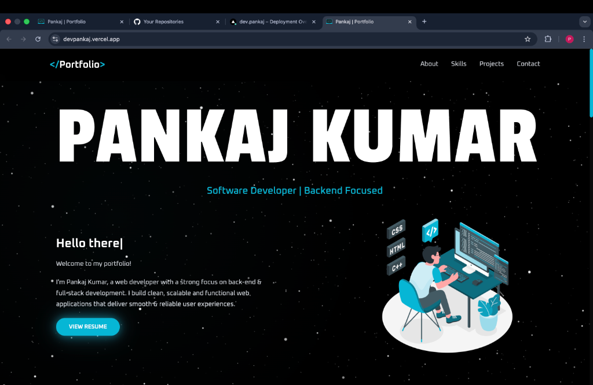

# Portfolio 🚀

A modern, responsive developer portfolio showcasing my projects and skills with smooth animations and elegant design.



🔗 **Live Demo**: [devpankaj.vercel.app](https://devpankaj.vercel.app)

## ✨ Features

- **Responsive Design** - Looks great on all devices from mobile to desktop
- **Smooth Animations** - Framer Motion powered animations for a polished feel
- **Dark Theme** - Sleek cyan accent on dark background
- **Section Navigation** - Smooth scroll between About, Skills, Projects, and Contact
- **All Projects Page** - Dedicated page to showcase all projects with filtering

## 🛠️ Tech Stack

| Frontend     | Styling       | Animation     |
| ------------ | ------------- | ------------- |
| React 18     | Tailwind CSS  | Framer Motion |
| Vite         | Custom Design | React Icons   |
| React Router |               |               |

## 📸 Sections

- **Hero** - Eye-catching introduction with animated typing effect
- **About** - Personal background and experience
- **Skills** - Technical skills organized by category
- **Projects** - Featured work with live demos and source code
- **Contact** - Get in touch form and social links

## 🚀 Quick Start

```bash
git clone https://github.com/Pankaj-jangidd/portfolio.git
cd portfolio
npm install
npm run dev
```

## 👤 Author

[Pankaj Kumar](https://github.com/Pankaj-jangidd)
